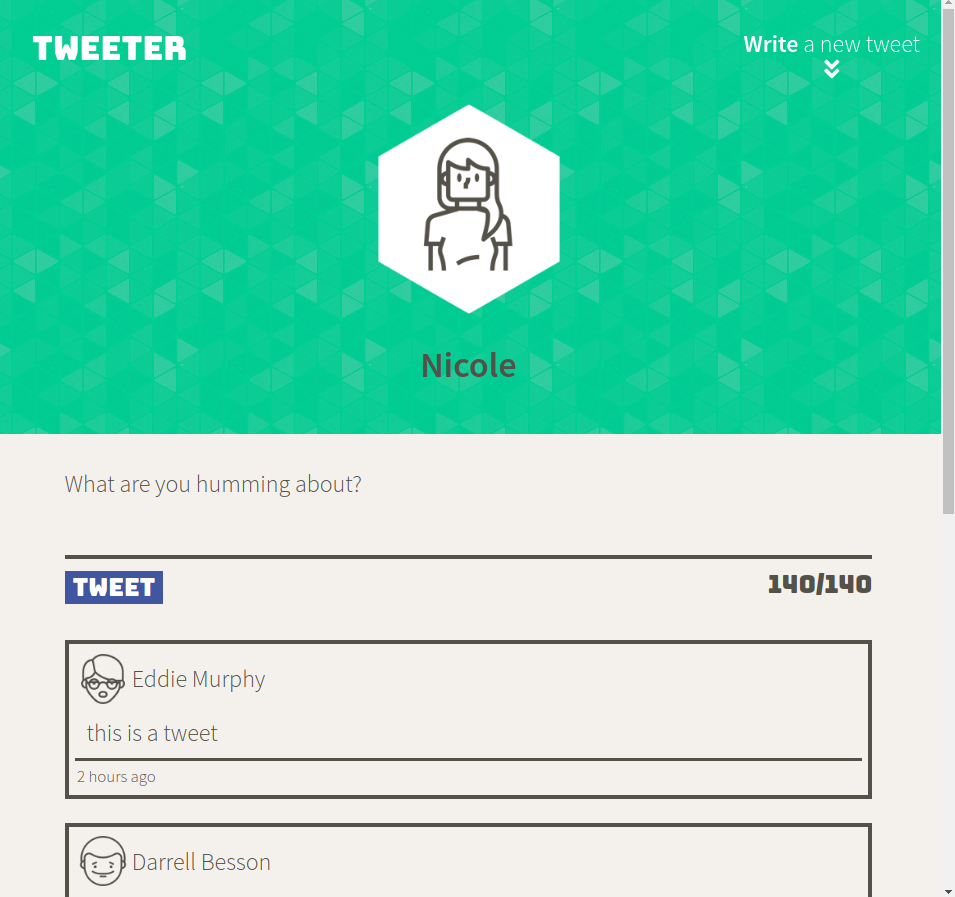

# Tweeter Project
### Contributors: Nicole Woodcock @npwxx
Tweeter is a simple, single-page Twitter clone.

This repository is the starter code for the project: Students will fork and clone this repository, then build upon it to practice their HTML, CSS, JS, jQuery and AJAX front-end skills, and their Node, Express and MongoDB back-end skills.

## Getting Started

1. Fork this repository, then clone your fork of this repository.
2. Install dependencies using the `npm install` command.
3. Start the web server using the `npm run local` command. The app will be served at <http://localhost:8080/>.
4. Go to <http://localhost:8080/> in your browser.

## Dependencies

- Express
- Node 5.10.x or above
- body-parser 1.19.0 or above
- chance  1.1.7 or above
- md5 2.3.0 or above

### Dev-Dependancies
- devDependencies:
  - nodemon 1.19.4 or above

### Screen Shots
## Desktop
Screenshot of desktop version

## Mobile
Screenshot of mobile version
